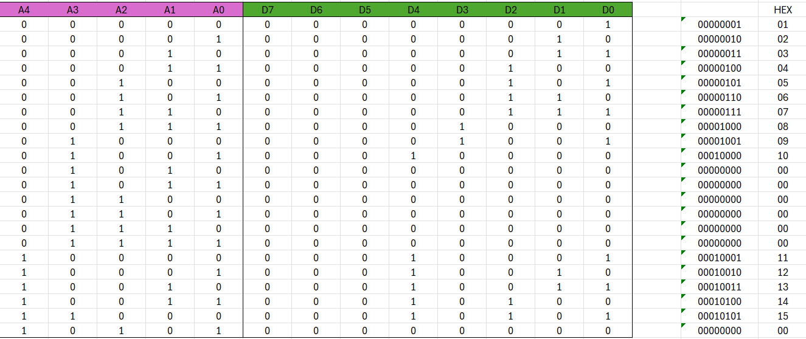
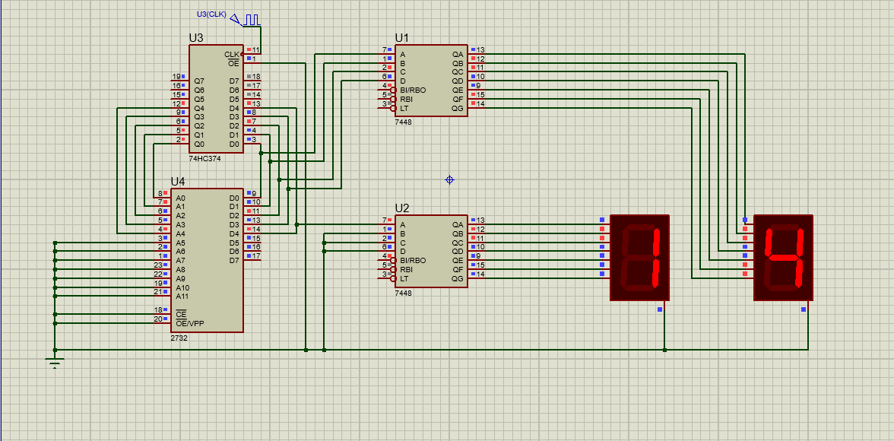

# Counter Project

## Overview
This project implements a digital counter circuit that counts from 0 to 15.  

## Components Used
- 2 × 7-Segment Displays
- 2 × 7448 BCD to 7-Segment Decoder/Driver IC
- 1 × 74HC374 Octal D-type Flip-Flop
- 1 × 2732 EPROM

## Project Contents
- `counter.xlsx` → Truth table (created in Excel)
- `counter.hex` → HEX file generated from the truth table using Prog-Studio
- `counter.pdsprj` → Proteus circuit design and simulation
- `Images/` → Contains all circuit and truth table images

**Truth Table**  
  

**Circuit Design**  

