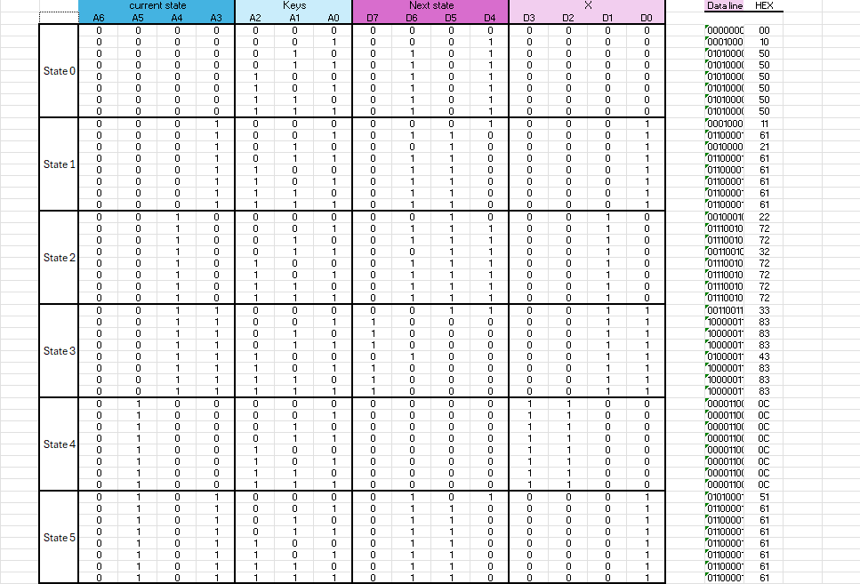
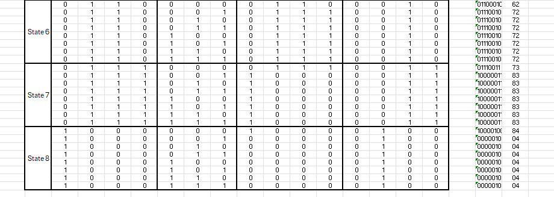
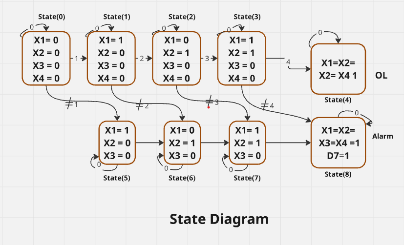
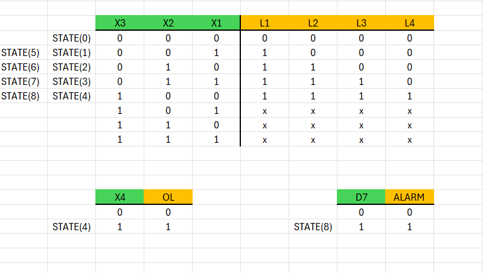
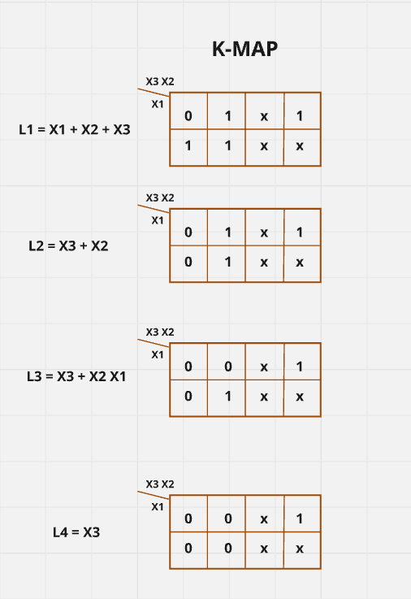

# Digital Lock Project

## Overview
A digital lock system that requires the correct password to unlock.

- The correct password is **1234**.
- Correct password → Green LED lights up, system enters **Open Lock** state.
- Wrong password → Buzzer activates, system enters **Alarm** state.

## Components Used
- 1 × Buzzer (indicates wrong password)
- 1 × Green LED (indicates correct password and unlocked state)
- 4 × LEDs (show each digit entered by the user)
- Logic gates: NOT, OR, AND
- 1 × 2723 EPROM
- 1 × 74HC374 Octal D-type Flip-Flop
- 1 × 74HC148 Priority Encoder
- Switches for entering the password
- 8 × Resistors

## Project Content
- `digital_lock.xlsx` → Truth table (created in Excel)
- `digital_lock.hex` → HEX file generated from the truth table using Prog-Studio
- `Digital_lock.pdsprj` → Proteus circuit design and simulation
- `Images/` → Circuit schematic, truth table screenshot, K-map, and the state diagram

**Circuit Design**  

**Truth Table**  

**State Diagram**  

**Output**  

**K-map**  

