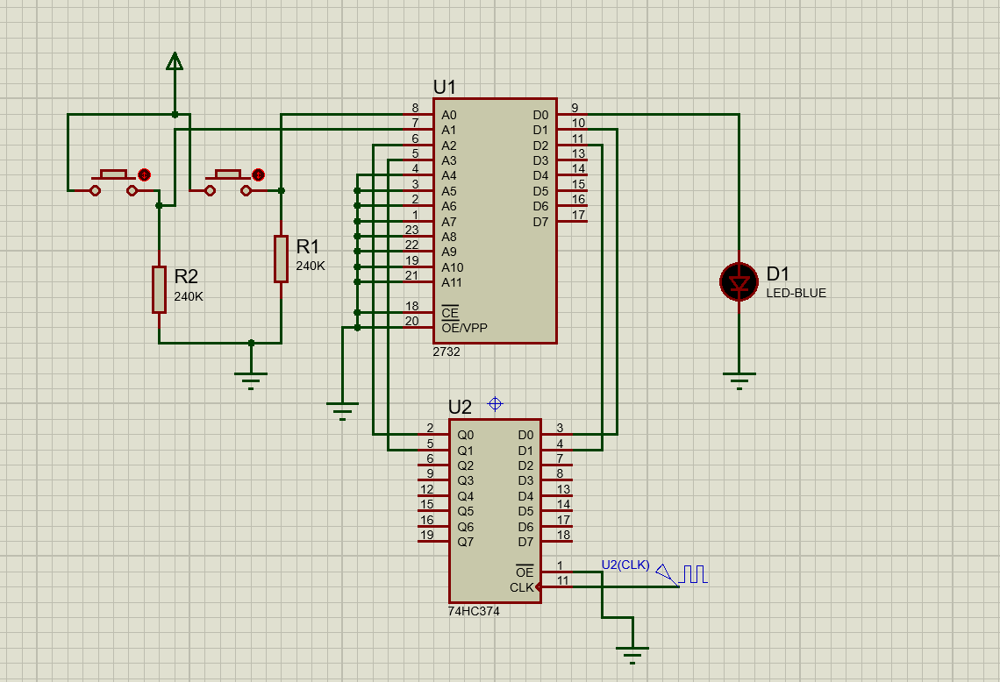
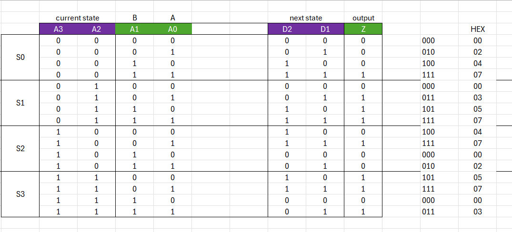
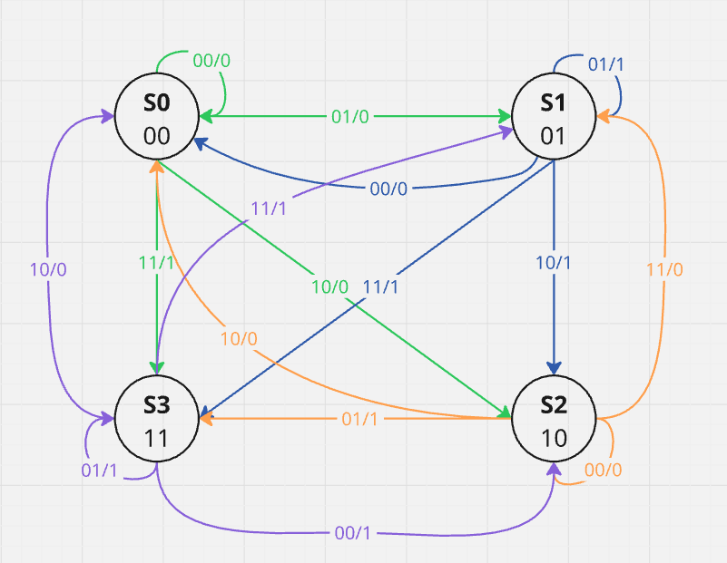

# Mealy FSM (AND-OR Switch) Project

## Overview
A Mealy finite state machine with two inputs (**A**, **B**) and one output (**Z**).

- Initial mode: **AND operation** → `Z(t) = A(t) · A(t-1)`
- When `B = 1`, mode changes to **OR operation** → `Z(t) = A(t) + A(t-1)`
- The next occurrence of `B = 1` switches the mode back to AND

## Components Used
- Switches (inputs A and B)
- LED (output Z)
- 2732 EPROM
- 74HC374 Octal D-type Flip-Flop
- Resistors

## Project Content
- `mealy_fsm.xlsx` → Truth table and state transition table (created in Excel)
- `mealy_fsm.hex` → HEX file generated from the truth table using Prog-Studio
- `mealy_fsm.pdsprj` → Proteus circuit design and simulation
- `Images/` → Circuit schematic, state table, and the state diagram

**Circuit Design**  
  

**State Table**  
  

**State Diagram**  
  
